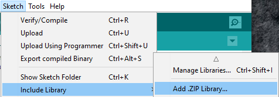

# Basic Arduino Thermocouple

---

This project was born out of my wonderful physics teacher's desire to intergrate the ALP (Applied Learning Programme) into his classes.

He had gotten himself a generic MAX6675-based K-Type Thermocouple kit off of Taobao so he could measure the live temperature of things when doing heat-related topics, but could never find enough time to research and set up the whole contraption himself. 

So, he approached me to help him with this.

I got it working fairly quickly, but it was quickly forgotten. (and somebody ripped the whole thing apart!)

So, here I am, almost exactly a year later, documenting this, as my last gift to my school. (and bolstering my EAE)

---

## Wiring

Requirements:

1. MAX6675 IC Breakout board

2. K-Type Thermocouple

3. An Arduino

(an Arduino Uno was used in the schematic but any should do, this only uses 261 bytes of RAM!)

---

## Loading Software

Requirements:

1. [Arduino IDE](https://www.arduino.cc/download_handler.php?f=/arduino-1.8.9-windows.zip)

2. [Adafruit MAX6675 Library](https://github.com/adafruit/MAX6675-library)

3. The code itself

4. The Arduino

Instructions:

Navigate to the MAX6675 Library Github.

Clone or Download > Download as zip

Repeat the above steps for the code itself

Download the Arduino IDE.

Unzip the arduino IDE.

Launch the Arduino IDE.

Sketch > Include Library > Add .ZIP Library...

Select MAX6675-master.zip (the one you just downloaded)

File > Open > thermocouple\thermocouple.ino 

Connect the Arduino

Check whether it's detected or not under
Tools > Port
(e.g `COM3/GENUINO UNO`)

Upload. (The arrow pointing left)

---

## Usage

Open the serial monitor.
Tools > Serial Monitor

At the bottom right, change `9600 baud` to `19200 baud`.

---

## Credits

My wonderful Physics teacher!

Adafruit for wonderful documentation

GreatScott! for getting me interested in Arduinos

---

## Licensing

Do whatever you want, just make sure your modifications are open-source.
